# IBM Granite.Code Installation 

The article explains about how to install `IBM Granite.Code` plugin in VS code and how to use it to genreate the code.

### 1. Install the IBM Granite.Code extension

1. Install the IBM Granite.code extension in VS code editor.

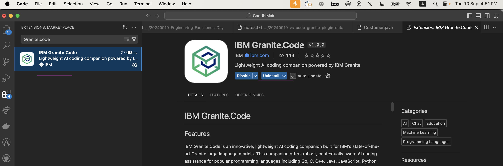

You can read more info about this extension like here https://marketplace.visualstudio.com/items?itemName=IBM.wca-core&utm_source=ibm_developer&utm_content=in_content_link&utm_id=blogs_awb-introducing-ibm-granite-code

The settings section of the extension shows the default url of the ollama serve location `localhost:11434`

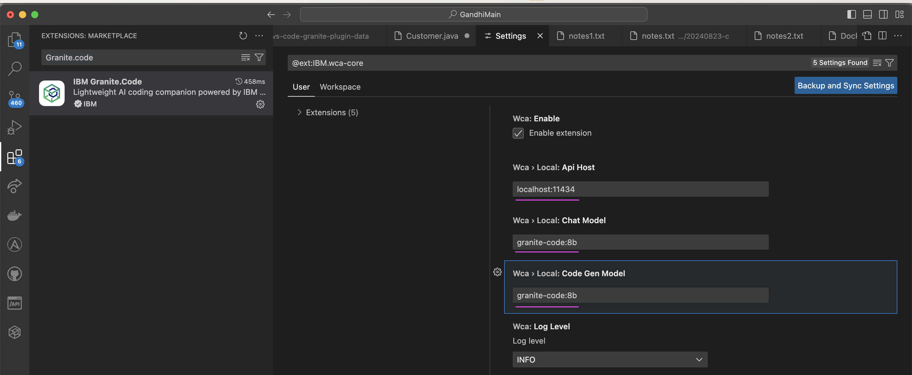


### 2. Install Ollama

1. Run the below command to install Ollama

```
brew install ollama

```

For Windows and Linux download and install from https://ollama.com/download

### 3. Start the Ollama inference server

1. In a command prompt, run the below command
```
ollama serve

```

It will start the server and Listening on  `localhost:11434`.

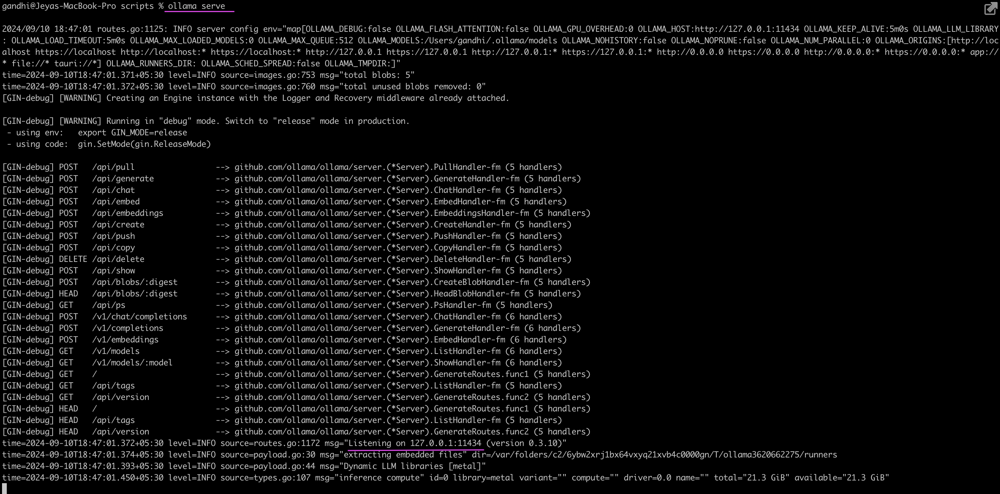

Keep this command prompt (window) open while you use Ollama (Granite.code extension in VS code).

This should be up and running whenever you want to use Ollama (Granite.code extension in VS code).

### 4. Install the Granite code model

1. In a new command prompt window, run the below command to pull the model image.

```
ollama run granite-code:8b 
```

You may be seeing the output like this ...
```
gandhi@Jeyas-MacBook-Pro 990-Temp % ollama run granite-code:8b
pulling manifest
pulling bf481f838ba0... 100% ▕██████████████████████████████████████████████████████████████████████████████████████████████████████████████████████████████████████████████████▏ 4.6 GB
pulling 977871d28ce4... 100% ▕██████████████████████████████████████████████████████████████████████████████████████████████████████████████████████████████████████████████████▏  679 B
pulling 43070e2d4e53... 100% ▕██████████████████████████████████████████████████████████████████████████████████████████████████████████████████████████████████████████████████▏  11 KB
pulling f1406f0e20d0... 100% ▕██████████████████████████████████████████████████████████████████████████████████████████████████████████████████████████████████████████████████▏   43 B
pulling befc696774ab... 100% ▕██████████████████████████████████████████████████████████████████████████████████████████████████████████████████████████████████████████████████▏  559 B
verifying sha256 digest
writing manifest
success
```

2. Run the below command once you see the `success`, to exit the Ollama command shell

```
/bye
```


### 5. Try using IBM Granite.Code Generation

1. Create a new Java class in VS Code as given in the below screenshot.

2. After you have typed `public Customer`, as highlighted, in the same line, press the below keys

`Option` and `.` for MAC 

`Alt` and `.` for Windows

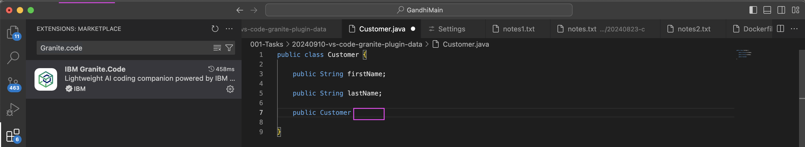


It will start showing up the rest of the code for the constructor as like this.

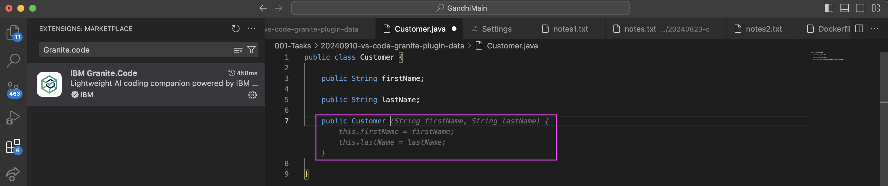

3. Press `Tab` to accept the generated code.

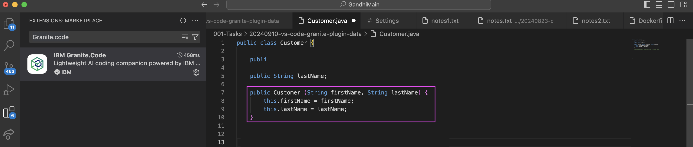


4. Give some comments 

5. Press the below keys from the next line of the comments

`Option` and `.` for MAC 

`Alt` and `.` for Windows

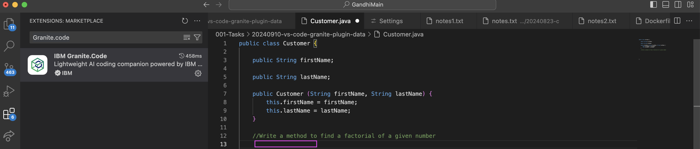


It will start showing up the code for the given comments as like this.

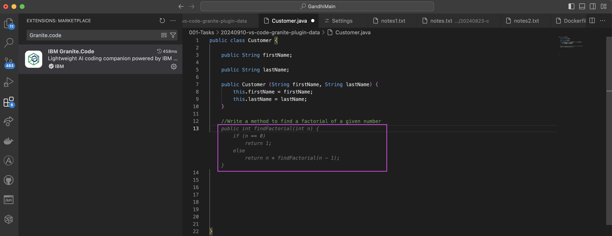

5. Press `Tab` to accept the generated code.

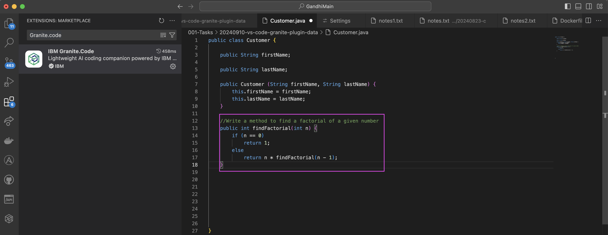


### 5. Try using IBM Granite Chatbot

You can also use chatbot.

1. In the VS code, on the left side icons, click chat bot icon. 

2. Enter the code generation text in the chat window
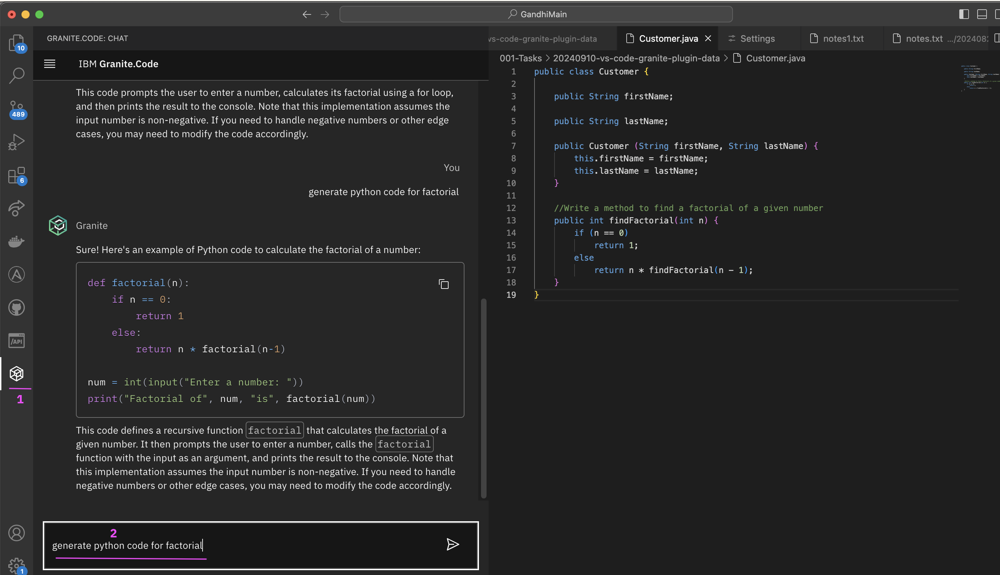

3. The code is generated in the chatbot window.

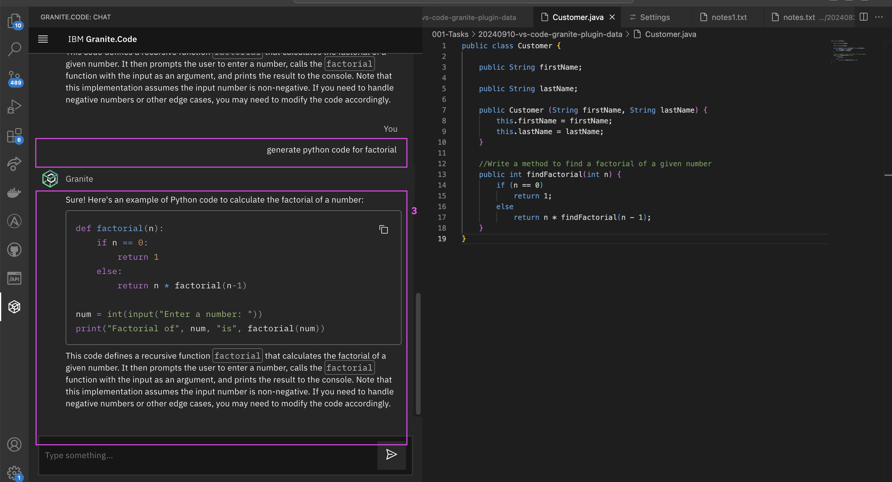